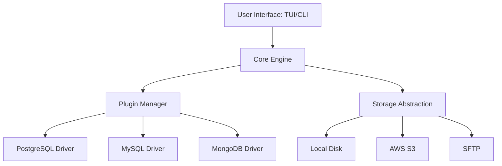

<p align="center">
  
</p>

# dbgecko

**dbgecko** is a high-performance, plugin-driven database backup and restore utility written in C. Designed for reliability and speed, it provides a unified interface to manage backups across multiple database engines and storage backends with minimal overhead.

[](https://opensource.org/licenses/Apache-2.0)
[](https://en.wikipedia.org/wiki/C_(programming_language))

---

## 🚀 Features

- **Plugin-Driven Architecture**: Modular driver system supporting **PostgreSQL**, **MySQL**, **MongoDB**, and **SQLite**.
- **Multi-Backend Storage**: Stream backups directly to the **Local Filesystem**, **AWS S3 (or Minio)**, or **SFTP** servers.
- **Dual Interface**:
  - **Interactive TUI**: A beautiful ncurses-based dashboard for visual management.
  - **Powerful CLI**: Headless mode for automation, CI/CD, and cron jobs.
- **Streaming I/O**: Efficient data handling that avoids buffering large files in memory, ensuring low resource usage even for TB-scale databases.
- **End-to-End Security**: Built-in encryption via OpenSSL and secure transport using SSH/SFTP.
- **Smart Configuration**: Simple YAML-based configuration with support for environment variable overrides.

---

## 📦 Quick Start
/tui mo
### Prerequisites

Ensure you have the following dependencies installed:

- `libyaml`
- `libssh`
- `OpenSSL`
- `ncurses`
- `libpcre2`
- `AWS C SDK` (s3, auth, http, io, etc.)

### Build

Compile the project using the provided build script:

```bash
chmod +x build.sh
./build.sh
```

### Install & Run

The `run.sh` script will install the binary to the `bin` directory and optionally add it to your PATH:

```bash
chmod +x run.sh
./run.sh
```

---

## ⚙️ Configuration

dbgecko uses a YAML configuration file. By default, it looks for `config.yml`.

```yaml
platform:
  version: 1.2

db:
  type: "postgres" # mysql, mongodb, sqlite
  uri: "${APPROPRIATE_URI_SCHEME_DEPENDING_ON_DB}"
  backup_mode: "full" # incremental, schema-only

storage:
  output_name: "${BACKUP_OUTPUT_NAME}"
  compression: "gzip"
  # Support for S3
  s3:
    region: "${BUCKET_REGION}"
    access_key: "${AWS_ACCESS_KEY_ID}"
    secret_key: "${AWS_SECRET_ACCESS_KEY}"
    bucket: "my-backups"
    use_ssl: true
  # Local storage transport
  # local:
  #   base_dir: ${PATH_TO_BACKUP_DIRECTORY}
  # and SFTP storage transport
  # sftp:
  #   private_key: "${PATH_TO_PRIVATE_KEY}"
  #   port: "${PORT_NUMBER}"
  #   host: "${HOST_HOSTNAME_OR_IP}"
  #   username: "${USERNAME}"
  #   password: "${PASSWORD}"
  #   max_retries: "${NUMBER}"
  #   timeout_seconds: "${NUMBER}"

plugin:
  dir: "${PATH_TO_PLUGIN_DIRECTORY}"
  path: "${PLUGIN_NAME}" # note that this has to be compatible with the type of the database and platform version, otherwise an error is thrown

runtime:
  log_level: ${NUMBER}
  thread_count: ${NUMBER}
  tmp_dir: "${PATH_TO_TEMP_DIRECTORY}"

```

*Precedence order: CLI Arguments > YAML Config > System Defaults.*

---

## 🛠 Usage

### TUI Mode (Default)
Simply run `dbgecko --config_path=[path to configuration file]` to enter the interactive dashboard:
```bash
dbgecko --config_path=[path to configuration file]
```

### CLI Mode
For automation, use the `--runtime_mode=cli` flag:

**Perform a backup:**
```bash
dbgecko --runtime_mode=cli --runtime_op=backup --config_path=[path to configuration file]
```

**Restore a backup:**
```bash
dbgecko --runtime_mode=cli --runtime_op=restore   --config_path=[path to configuration file]
```

---

## 🏗 Architecture

dbgecko follows a modular design where the core engine handles scheduling, streaming, and logging, while specific drivers handle database interactions.



---

## 📄 License

This project is licensed under the Apache License 2.0 - see the [LICENSE](LICENSE) file for details.
